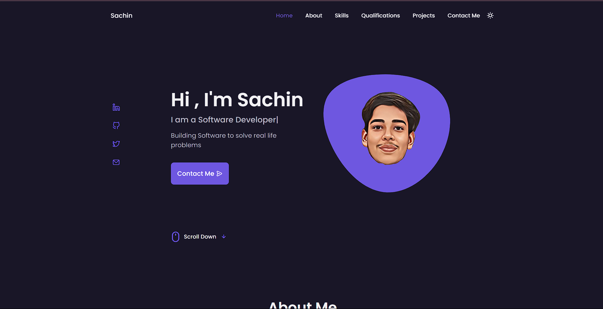

<h1><a href="https://sachins0.github.io/Portfolio_Website/">Personal Portfolio Website</a></h1>

  

 

⭐ Star this repo on GitHub — it helps!

## Features 📋

⚡️ Fully Responsive\
⚡️ Valid HTML5 & CSS3\
⚡️ Typing animation\
⚡️ Functional Contact Form

## Sections 📚

✔️ Home\
✔️ About\
✔️ Skills \
✔️ Qualifications \
✔️ Projects\
✔️ Contact Me\
✔️ Footer

To view a live example, **[click here](https://sachins0.github.io/Portfolio_Website//)**

## Tools Used 🛠️

- [**GitHub Pages**](https://docs.github.com/en/pages) - To host my static website (HTML, CSS, JS).
- [**Font Awesome**](https://fontawesome.com/) - A font and icon toolkit based on CSS.
- [**Iconscout**](https://iconscout.com/unicons) - Ready-to-use high-quality SVG icons.
- [**Swiper.js**](https://swiperjs.com/) - JavaScript Library
